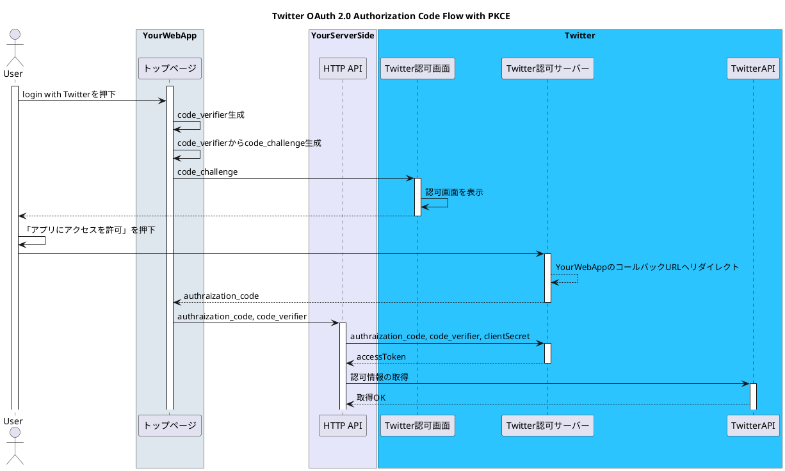

# 前提

* Twitterの`OAuth 2.0 Authorization Code Flow with PKCE`を利用
  * \+ Confidential Clientを利用(not Public Client)
* Confidential ClientのHTTP APIのE2Eテストで必要な認可コード取得処理を自動化

# 自動テストしたい箇所

Twitterの`OAuth 2.0 Authorization Code Flow with PKCE`は、以下のようなフローとなります。詳細は、[Developer Platform](https://developer.twitter.com/en/docs/authentication/oauth-2-0/authorization-code)が参考になります


:::details plantuml


:::

図のYourServerSideのHTTP APIでは、認可コード(`authraization_code`)を受け取る必要があり、この認可コード生成は手動でポチポチやるのが結構面倒です。今回は、この手動ポチポチを[puppeteer](https://github.com/puppeteer/puppeteer)と[jest](https://github.com/facebook/jest)を利用して自動化します。

:::message
PlaywrightやCypressを使う案も考えましたが、テストツール同梱でフロントエンドのテストをするわけではないので、ライトに利用できるpuppeteerを採用しました。
:::

## 実装

コメントにて補足します

```ts:puppeteerを起動し、認可画面を押下するコード
import * as Puppeteer from 'puppeteer';
import * as chrome from 'chrome-cookies-secure';

// PKCEに必要なcodeVerifier,codeChallenge生成する関数です(後述)
import { generateCodeChallenge, generateRandomString } from './text';

const codeVerifier = generateRandomString(45);
const codeChallenge = generateCodeChallenge(codeVerifier);

const COOKIE_URL = 'https://twitter.com';
// 本コードで指定したChromeのプロファイルでログイン済みのTwitterアカウントでアプリに対し認可を与えることになります
// Chromeのプロファイル情報は、chrome://versionで確認できます
const CHROME_PROFILE_NAME = 'Default';
const AUTH_BUTTON_SELECTOR = '<認可ボタンのセレクター>'
const TWITTER_AUTH_ENDPOINT =
  'https://twitter.com/i/oauth2/authorize?response_type=code&' +
  'client_id=<ClientId>&' +
  'redirect_uri=<リダイレクトURL>&' + // listenしてないとNG(*1)
  'scope=tweet.read%20users.read%20offline.access&' +
  'state=<state>&' +
  `code_challenge=${codeChallenge}&` +
  'code_challenge_method=s256';
const JEST_TIMEOUT_MILLSECS = 5 * 60 * 1000;

jest.setTimeout(JEST_TIMEOUT_MILLSECS);

interface Cookie {
  name: string;
  value: string;
  expires: number;
  domain: string;
  path: string;
  Secure: boolean;
}

// 通常puppeteerはsandboxを立ち上げるため、Twitterへログインし直す必要がありますが、今回は省略する作りになっています
// 第一引数にChromeのプロファイルを指定し、第二引数にプロファイルで取得するCookie情報のURLを指定します
const getCookies = (profile: string, url: string): Promise<Cookie[]> => {
  return new Promise((resolve, reject) => {
    chrome.getCookies(
      url,
      'puppeteer',
      (err: Error, cookies: Cookie[]) => {
        err ? reject(err) : resolve(cookies);
      },
      profile,
    );
  });
};

export const readyTwitterAuthGrant = async () => {
  const browser = await Puppeteer.launch({
    headless: false,
  });
  // https://twitter.comのCookie情報を取得
  const cookies = await getCookies(CHROME_PROFILE_NAME, COOKIE_URL);
  const page = await browser.newPage();
  // puppeteerのsandbox環境にCookie情報をセット
  await page.setCookie(...cookies);
  await page.goto(TWITTER_AUTH_ENDPOINT);

  const authButton = await page.waitForSelector(AUTH_BUTTON_SELECTOR);
  if (!authButton) {
    throw new Error('AUTH_BUTTON_SELECTOR changed?');
  }
  await authButton.click(); // YourWebAppへリダイレクト
  await page.waitForNavigation(); // リダイレクト待ち
  const redirectUri = page.url(); // リダイレクトURLを取得
  const url = new URL(redirectUri);
  const tmpState = url.searchParams.get('state');
  const tmpCode = url.searchParams.get('code'); // 認可コード取得
  if (!(tmpState && tmpCode)) {
    throw new Error();
  }

  return {
    data: {
      authCode: tmpCode,
      codeVerifier: codeVerifier,
    },
    tearDown: async () => {
      await browser.close();
    },
  };
};
```

*1 YourWebAppにリダイレクトするURLが非到達の場合は、以下コードで両対応可

:::details コードを展開する
```ts
const redirectUri = await (async (): Promise<string> => {
  const isValidUrl = (url: string) => {
    const parsedEventUrl = new URL(url);
    if (parsedEventUrl.host === REDIRECT_HOST) {
      return true;
    }
    return false;
  };

  return new Promise((resolve) => {
    // リダイレクト先が非到達なURLの場合
    page.on('requestfailed', async (req) => {
      const eventUrl = req.url();
      if (isValidUrl(eventUrl)) {
        resolve(eventUrl);
      }
    });
    // リダイレクト先が到達可能なURLの場合
    page.on('response', async (res) => {
      const eventUrl = res.url();
      if (isValidUrl(eventUrl)) {
        resolve(eventUrl);
      }
    });
  });
})();
```
:::


```ts:codeVerifier,codeChallengeを生成する関数
import * as crypto from 'crypto';

export const generateRandomString = (length: number) => {
  let text = '';
  const possible =
    'ABCDEFGHIJKLMNOPQRSTUVWXYZabcdefghijklmnopqrstuvwxyz0123456789';

  for (let i = 0; i < length; i++) {
    text += possible.charAt(Math.floor(Math.random() * possible.length));
  }

  return text;
};

export const generateCodeChallenge = (codeVerifier: string) => {
  const challenge = crypto
    .createHash('sha256')
    .update(codeVerifier)
    .digest('base64')
    .replace(/=/g, '')
    .replace(/\+/g, '-')
    .replace(/\//g, '_');

  return challenge;
};
```

```ts:認可コードを送信する先のHTTP APIのテストコード
import { readyTwitterAuthGrant } from './helpers/auth';

let data: { authCode: string; codeVerifier: string };
let tearDown: () => Promise<void>;

beforeAll(async () => {
  const res = await readyTwitterAuthGrant();
  data = res.data;
  tearDown = res.tearDown;
});

afterAll(async () => {
  await tearDown(); // sandobxの停止
});

describe('認可APIへauthCodeを送信する', () => {
  test('Return 200', async () => {
    // data.authCode, data.codeVerifierをHTTP APIに送信し、レスポンスを確認(省略)
  });
});
```

# 課題

* headlessにすると失敗する

# 最後に
とりあえず快適にテストできそうです。もっと良い方法ありそうな気がしてならないですが、、ありましたらご教授いただけると嬉しいです。

# 参考
Twitter公式と以下の記事でフローに関しての理解が深まりました。ありがとうございます！

* [Twitter OAuth2.0の設定や動作まとめ](https://zenn.dev/kg0r0/articles/8b1cfe654a1cee)

